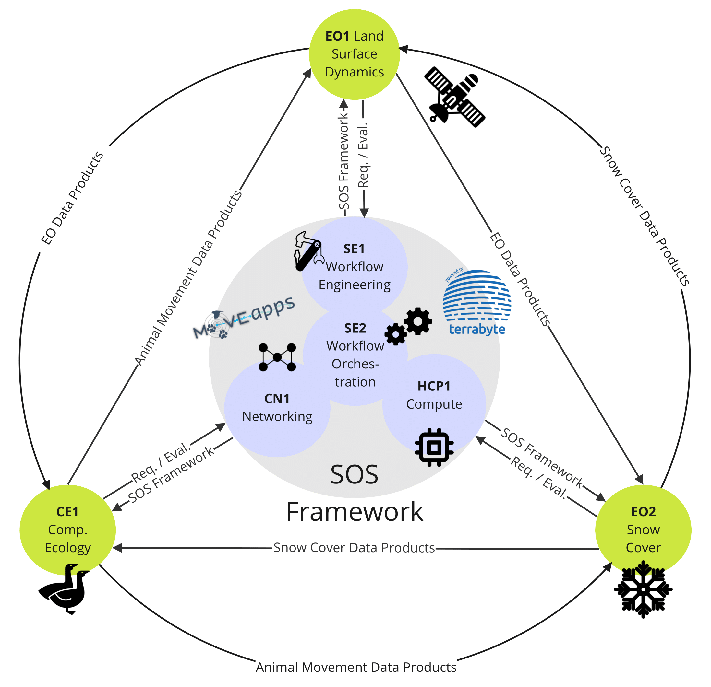

# Serverless Scientific Computing for Earth Observation and Sustainability Research 
##### SOS - DFG Research Unit 5696
Modern research in the field of **Earth Observation (EO)** and **sustainability** presents challenges for computing, storage, and communication infrastructure required to analyze the vast amounts of data from remote sensing systems. To develop, execute, optimize, and maintain EO workflows, geoscientists need in-depth expertise in **IT and data sciences**.  

Developers face challenges such as:  
- A large number of algorithms  
- Contradictory recommendations  
- Non-transparent data (pre)processing  
- Lack of standards for workflow specification  

This leads to **limited reusability** of workflow implementations and **poor reproducibility** of results. Furthermore, processing vast amounts of data (**petabytes**) from distributed and heterogeneous sources presents a significant **entry barrier** for geoscientists.  

## Research Goals  

The main goal of this research group is to develop a **framework** consisting of a set of methods, models, and architectures that serve as the foundation for **serverless scientific computing and engineering**. In **serverless computing**, computing, storage, and communication resources are abstracted.
### Specific Objectives  

1. **Automation, sharing, and reuse** of EO workflows across projects, teams, application domains, and organizations.  
2. **Elimination of technical entry barriers** for developing and executing complex, large-scale EO workflows involving multiple distributed and heterogeneous data sources.  

We envision a **component-based workflow engineering methodology** that supports the composition of complex processing workflows from ready-to-use, **generic or domain-specific components**—without requiring expert knowledge of the algorithms used or their internal implementation details.  

## Interdisciplinary Collaboration  

We believe these goals can only be achieved through collaboration between **computer scientists, geoscientists, and ecologists** in an **interdisciplinary research environment**. To this end, part of the research group is led by geoscientists and ecologists and focuses on the following **domain-specific research objectives**:  

- **(a)** Investigating the impact of **land surface dynamics** on the movement patterns of **migrating animals** as a basis for predicting future space usage and species composition.  
- **(b)** Examining the effects of **climate change** on **snow cover and melting**.  

[//]: # (## Expected Impact  )

[//]: # ()
[//]: # (Overall, we anticipate a **significant impact** on the state of research in **scientific computing for Earth observation and sustainability studies**. This will:  )

[//]: # (- Greatly enhance **productivity** in these domains.  )

[//]: # (- Enable **novel interdisciplinary research opportunities** beyond remote sensing and ecology.  )

